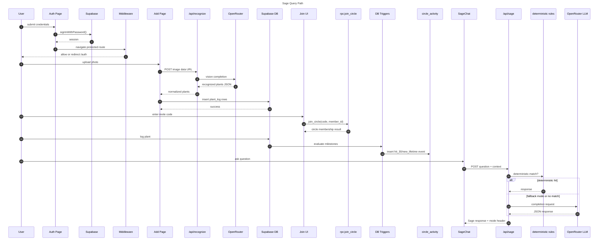

# Sequence Diagrams

Generated from baseline architecture flows.

```mermaid
sequenceDiagram
    autonumber

    title Auth Flow
    participant U as User
    participant A as Auth Page
    participant SB as Supabase
    participant MW as Middleware
    U->>A: submit credentials
    A->>SB: signInWithPassword()
    SB-->>A: session
    A->>MW: navigate protected route
    MW-->>U: allow or redirect /auth

    title Add / Log Flow
    participant Add as Add Page
    participant Rec as /api/recognize
    participant OR as OpenRouter
    participant DB as Supabase DB
    U->>Add: upload photo
    Add->>Rec: POST image data URL
    Rec->>OR: vision completion
    OR-->>Rec: recognized plants JSON
    Rec-->>Add: normalized plants
    Add->>DB: insert plant_log rows
    DB-->>Add: success

    title Circles Join + Scoring
    participant Join as Join UI
    participant RPC as rpc:join_circle
    participant Tr as DB Triggers
    participant Feed as circle_activity
    U->>Join: enter invite code
    Join->>RPC: join_circle(code, member_id)
    RPC-->>Join: circle membership result
    U->>DB: log plant
    DB->>Tr: evaluate milestones
    Tr->>Feed: insert hit_30/new_lifetime event

    title Sage Query Path
    participant SageUI as SageChat
    participant SageAPI as /api/sage
    participant Rules as deterministic rules
    participant Model as OpenRouter LLM
    U->>SageUI: ask question
    SageUI->>SageAPI: POST question + context
    SageAPI->>Rules: deterministic match?
    alt deterministic hit
      Rules-->>SageAPI: response
    else fallback mode or no match
      SageAPI->>Model: completion request
      Model-->>SageAPI: JSON response
    end
    SageAPI-->>SageUI: Sage response + mode header

```
